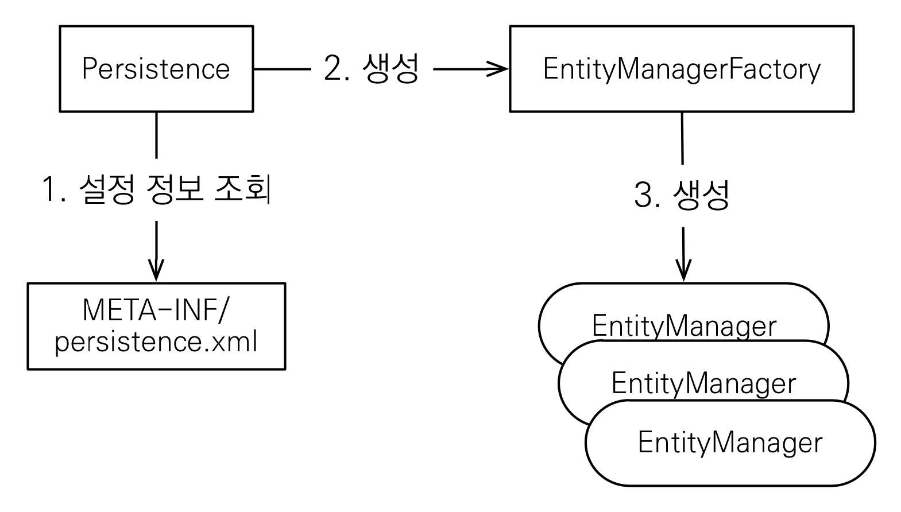

# 섹션 02. JPA 시작하기
## 01. Hello JPA - 프로젝트 생성
- `pom.xml`: 라이브러리 추가
- `persistence.xml`: JPA 설정
### DB 방언
`JPA`는 특정 `DB`에 종속되지 않도록 설계되어 있다.
- 각각의 `DB`에서 제공하는 `SQL 문법`, `함수`는 서로 조금씩 다르다.
  - 이렇게 다른 부분을 `DB의 방언`, 즉 `SQL 표준`을 지키지 않는 각 `DB`들만의 고유 기능이라 말한다.
  - `hibernate.dialect` 속성에 `DB`를 지정해 `hibernate`가 지정된 `DB 방언`을 매핑 해준다.
    - 실무에서 사용되는 `DB`의 대부분을 지원한다.  
  

## 02. Hello JPA - 애플리케이션 개발
### JPA 구동 방식

- `EntityManagerFactory`는 하나만 생성해 애플리케이션 전체에서 공유
- `EntityManager`는 쓰레드간 공유하지 않음
  - 사용하고 나면 버려야 함
- `JPA`의 모든 `데이터 변경`은 `트랜잭션` 안에서 실해되어야 함  
 

### JPQL
`JPA`가 제공하는 `SQL을 추상화`한 `객체 지향 쿼리 언어`, 특정 `DB SQL`에 의존하지 않음
- `JPA`를 사용하게 되면 `엔티티 객체를 중심`으로 개발하게 됨
  - 그렇기에 `검색`을 할 때도 `DB 테이블`이 아닌 `엔티티 객체`를 대상으로 검색
  - 하지만 모든 `DB 데이터`를 `객체`로 변환해 검색하는 것은 불가능 함
    - 필요한 `DB 데이터`만 `객체`로 변환하는 작업이 필요
    - `DB`에서 선택적으로 데이터를 불러오기 위해서는 `검색 조건이 포함된 SQL` 필요
- `SQL` 문법과 유사한 점이 많음
  - `SELECT, FROM, WHERE, GROUP BY` 등을 지원
- `SQL`과 차이점
  - `JPQL`: `엔티티 객체` 대상으로 쿼리
  - `SQL`: `DB 테이블` 대상으로 쿼리