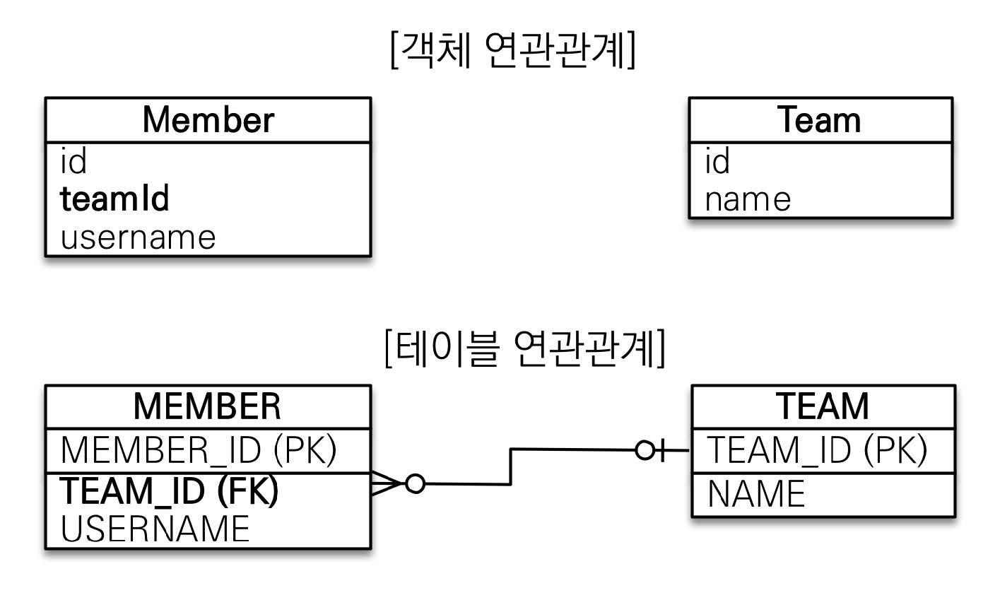
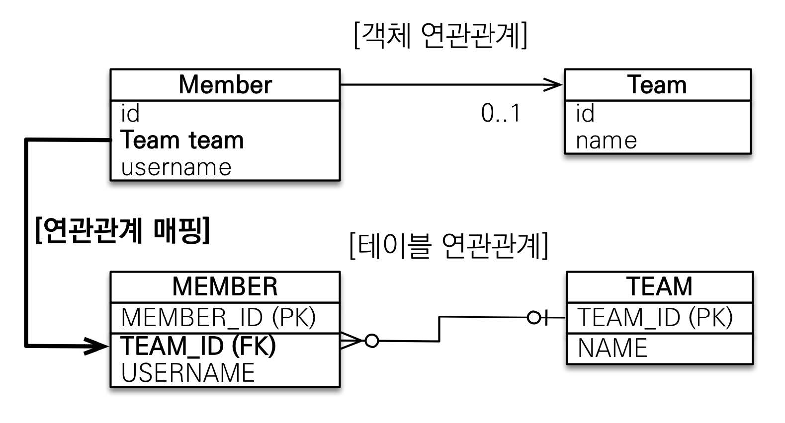
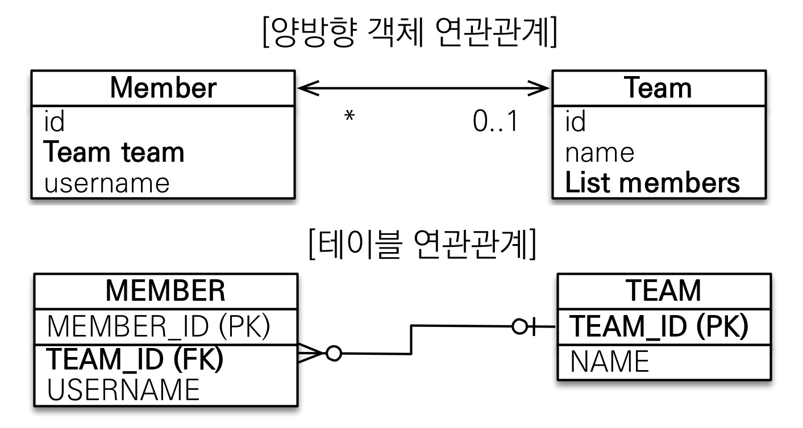
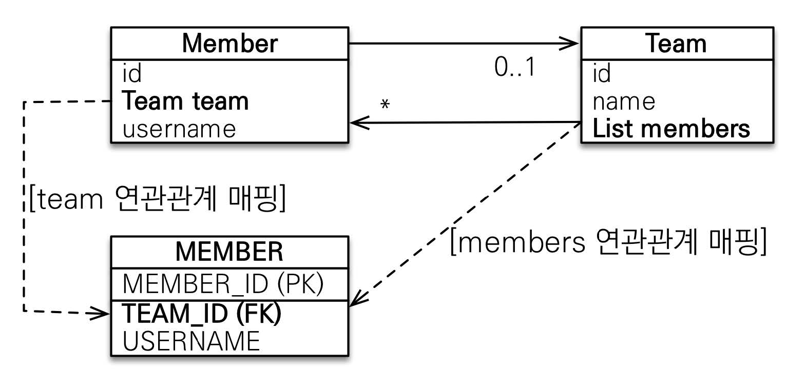

# 섹션 05. 연관관계 기초 매핑
- 목표
  - 객체와 테이블 연관관계 차이
  - 객체의 참조와 테이블의 외래 키 매핑
  - 연관관계 용어 이해
## 00. 연관관계 필요 이유
객체를 `테이블에 맞춰 모델링` 한다고 하자 (연관관계가 없는 객체)

```java
import jakarta.persistence.*;

@Entity
public class Team {
  @Id
  @GeneratedValue
  private Long id;

  @Column(name = "TEAMNAME")
  private String name;
}

@Entity
public class Member {
  @Id
  @GeneratedValue
  private Long id;

  @Column(name = "USERNAME")
  private String name;

  @Column(name = "TEAM_ID")
  private Long teamId;        // 객체를 참조한 것이 아니라 외래 키를 그대로 가져다 씀
}
```
- 객체를 참조하지 않고 `외래 키`를 그대로 사용하게 된다.
  - 외래 키 식별자를 직접 다루어야 한다.
    - 외래 키를 통해 식별자 조회를 해야 해당 정보에 접근 할 수 있다.
  - 결국 테이블에 맞춰 `데이터 중심`으로 객체를 모델링 하면, `협력 관계`를 만들 수 없다.
    - `테이블`: `외래 키로 조인`을 사용해 연관 테이블을 찾음
    - `객체`: `참조`를 사용해 연관 객체를 찾음  
  <br/><br/><br/>

## 01. 단방향 연관관계
객체 지향 모델링 (객체 연관관계 사용)

```java
import jakarta.persistence.*;

@Entity
public class Team {
  @Id
  @GeneratedValue
  private Long id;

  @Column(name = "TEAMNAME")
  private String name;
}

@Entity
public class Member {
  @Id
  @GeneratedValue
  private Long id;

  @Column(name = "USERNAME")
  private String name;

  // 연관관계 설정
  @ManyToOne                        // 연관관계 표기 (다대일)
  @JoinColumn(name = "TEAM_ID")     // FK 매핑 및 테이블 컬럼 명 지정 (DB 테이블 연관관계)
  private Team team;                // Team 객체 참조 저장 (객체 연관관계)
}
```
- `Member`는 `Team` 객체를 참조하고 저장
  - `JPA`는 참조한 `Team 식별자(Team.id, PK)`를 외래 키로 사용해 적절한 등록 쿼리를 생성해 줌
  - 덕분에 `객체 그래프`를 통해서 특정 `Member`엔티티와 연관있는 `Team`엔티티를 조회 할 수 있음
- 연관관계 설정 시 아래의 `annotation`을 사용하여 설정해 준다.
  - `@ManyToOne`: 연관관계의 다중성을 나타내는 매핑 정보, 해당 `annotation`은 `다대일`
  - `@JoinColumn`: `테이블 외래 키`를 매핑해 준다.
    - `name`을 통해 매핑 된 외래 키의 이름을 지정 할 수 있다.
    - 결과적으로 `DB 테이블 간의 연관관계를 설정`하게 되며, `Member-Team` 두 테이블이 `TEAM_ID`로 연관관계를 맺게 된다.  
<br/><br/><br/>

## 02. 양방향 연관관계와 연관관계의 주인 - 기본
### 양방향 매핑
객체 지향 모델링 (객체 연관관계 사용)


```java
import jakarta.persistence.*;

import java.util.*;

// Team(일, 1) 의 경우 연관관계의 객체의 컬렉션을 추가한다.
@Entity
public class Team {
  @Id
  @GeneratedValue
  private Long id;

  @Column(name = "TEAMNAME")
  private String name;
  
  @OneToMany(mappedBy = "team")                     // 연관관계 표기 (일대다)
  private List<Member> members = new ArrayList<>(); // Member 객체 컬렉션 참조 저장 (객체 연관관계)
}

// Member(다, N) 의 경우 단방향 연관관계와 동일하게 세팅한다.
@Entity
public class Member {
  @Id
  @GeneratedValue
  private Long id;

  @Column(name = "USERNAME")
  private String name;

  // 연관관계 설정
  @ManyToOne                        // 연관관계 표기 (다대일)
  @JoinColumn(name = "TEAM_ID")     // FK 매핑 및 테이블 컬럼 명 지정 (DB 테이블 연관관계)
  private Team team;                // Team 객체 참조 저장 (객체 연관관계)
}
```
- `양방향 연관관계`는 기존의 `단방향 연관관계`에서 `단방향 객체 연관관계`가 추가된 것이다.
  - 결과적으로 `단방향 객체 연관관계 2개`, `테이블 연관관계 1개`를 포함하고 있다.
- 추가된 `단방향 객체 연관관계`에 대해서 살펴보자
  - `Team` 객체에 `Member` 컬렉션을 추가해 `Member` 객체들을 참조 저장한다.
  - `@OneToMany`를 통해 `일대다` 연관관계를 표기한다.
    - 그리고 제일 중요한 `mappedBy` 속성을 통해 `연관관계 주인` 객체의 `FK 필드 명`을 지정한다.  
<br/><br/>

### 연관관계 주인과 mappedby
해당 내용을 이해하려면 `객체와 테이블`이 관계를 맺는 `차이`에 대해서 이해해야 한다.
#### 객체와 테이블의 관계 차이
- `객체`: 객체 참조를 통해 `단방향 연관관계 2개`를 가지고 있다.
  - 사실 `양방향`이라고 표현하긴 하지만 사실은 서로 다른 `단방향` 연관관계를 2개 가지고 있는 것이다.
- `테이블`: `FK`를 통해 `연관관계 1개`를 가진다.
  - DB 에는 사실 `단방향, 양방향` 구분이 없이 `양방향`으로 관계를 가진다.
  - `하나의 외래 키(FK)`로 `양방향 연관관계`를 가진다는 소리  
<br/>

#### 두 객체 연관관계 중 어떤걸 매핑해야 하나?
객체의 연관관계가 `2개`가 되면서 어떤 연관관계 기준으로 테이블과 매핑해야 하는지 고민이 될 것이다.

- 위 그림처럼, 우리는 2가지 방법으로 테이블과 매핑 할 수 있다.
  - 하지만 결국 두 객체 연관관계 중 `하나의 연관관계와 테이블을 매핑하고 외래 키(FK)를 관리`해야 한다.
  - 즉, `연관관계의 주인`을 정할 필요가 있다.  
<br/>

#### 연관관계의 주인(Owner)
양방향 매핑 시 객체의 두 연관관계 중 `하나`를 `연관관계 주인`으로 지정해야 한다.
- 연관관계의 주인만 `FK(외래 키)`를 `관리(등록, 수정)` 할 수 있다.
  - 그러므로 연관관계의 주인은 `FK`를 가진 쪽을 선택하는 것이 좋다 → `(매우 권장)`.
  - 주인이 아닌 쪽은 `읽기`만 가능하다.
- 연관관계의 주인 쪽에서는 `mappedBy` 속성을 사용하지 않는다.
  - 즉, `mappedBy` 속성이 적용된 쪽은 `연관관계의 주인이 아니며`, `연관관계 상대에 FK 가 있다`는 것을 명시한다.  
<br/><br/>

### 양방향 매핑 시 자주하는 실수
1. 연관관계 주인에 값을 입력하지 않는 경우
   - 한 마디로 `FK`로 사용하는 `객체`를 지정하지 않은 경우이다.
     - 어떤 객체를 참조해야 하는지는 지정하는 것은 당연하다.
   - `FK`가 없는데 테이블 연관관계가 정상 작동 할 수 있을까?
   - 연관관계 주인이 아닌 쪽에 값을 입력하지 않는 것은 권장하지는 않지만 상관 없다.
2. 그러면 연관관계 주인 쪽에만 값을 입력하면 될까?
   - `객체지향적`으로 생각하면, `순수 객체 상태를 고려`하여 `양쪽에 모두 값을 설정`하는 것이 좋다.
     - 예를 들어 `한 트랜잭션 내`에서 `등록, 조회`를 하는 경우
        - 조회한 객체는 `DB`가 아닌 `영속성 컨텍스트의 1차 캐시`에서 조회한 것
          - 현재 `영속성 컨텍스트`의 `Team` 객체의 컬렉션에는 입력된 값이 없다.
          - 즉, 해당 정보로 `Member` 컬렉션을 조회하면 아무런 정보도 찾을 수 없다.
   - `연관관계 편의 메서드`를 생성해 실수 없이 `양쪽 모두에 값을 설정`하도록 하자.
     - 취향이겠지만 메서드 생성시 기존 `getter, setter`와 다른 로직이 있다면 `getxxx, setxxx` 외의 메서드 명을 사용하도록 하자.
     - 기존 관례와 다르다는 것을 명시하는 효과도 볼 수 있음  
<br/><br/>

### 반드시 양방향 매핑을 해야 할까?
아니다 사실 `단방향 매핑`만으로도 이미 연관관계 매핑은 끝이다.
- 양방향 매핑은 위에서도 언급했지만 결국 `역방향 조회(객체 그래프 탐색) 기능`이 추가 된 것 뿐이다.
- 물론 `JPQL`에서 역방향 조회가 필요한 경우가 많은 것은 사실이다.
  - 그렇기에 일단 `단방향 매핑`을 잘 마치고 필요에 따라 `양방향 매핑`으로 바꿔주는 작업을 하도록하자.
  - 어차피 `양방향 매핑`으로 바꾸는 작업은, `단방향 객체 연관관계`를 하나 추가하므로 `테이블에 영향이 없음`