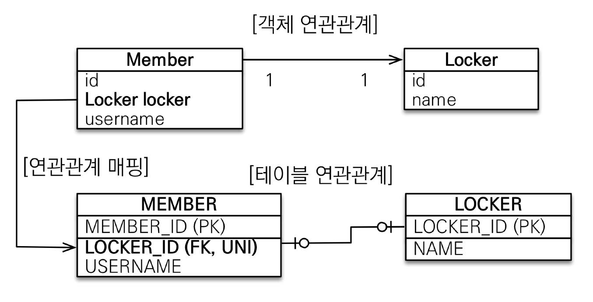

# 섹션 06. 다양한 연관관계 매핑
연관관계 매핑시 다음 3가지를 고려해야 한다.
1. 다중성
   - `다대일(N:1)`: @ManyToOne
   - `일대다(1:N)`: @OneToMany
   - `일대일(1:1)`: @OneToOne
   - `다대다(N:M)`: @ManyToMany
2. 단방향, 양방향
   - `테이블`: `FK(외래 키)` 하나로 양쪽 조인이 가능
     - 사실 테이블에서는 `방향 개념`이 없음
   - `객체`: 참조용 필드가 있는 쪽으로만 참조 가능
     - `단방향 = 한 쪽에서만 참조 가능`, `양방향 = 서로 참조가 가능`
3. 연관관계 주인
   - 객체의 `단방향 연관관계`가 2개이기 때문에 생기는 딜레마를 해결하기 위해 연관관계의 `주인`을 지정 할 필요가 있음
   - `연관관계 주인 = FK(외래 키)를 가지고 있다`라고 생각하자.
     - 이전에도 말했지만 주인이 아닌 쪽은 `FK`에 영향을 주지 않으며 단순 `조회`만 가능하다.
## 01. 다대일 [N:1]
### 다대일 단방향
가장 많이 사용하는 연관관계로 반대 개념은 `일대다`이다.
  
  

### 다대일 양방향
`FK(외래 키)`가 있는 쪽이 `연관관계의 주인`이며 객체 양쪽을 서로 참조 할 수 있음
  
   

## 02. 일대다 [1:N]
`다대일` 관계를 보다 이 관계를 보니 정말 어지럽다...(쓰고 싶지 않음)
### 일대다 단방향

- `일대다(1:N)` 단방향에서 `일(1)`이 `연관관계의 주인`이 된다.
  - 하지만 `테이블`에서는 항상 `다(N)`쪽에 `FK`가 존재함
  - 여기서 부터 `객체와 테이블`의 연관관계 차이로 인한 딜레마 발생
  - 결국 `연관관계 주인`인 객체는 상대 테이블의 `FK`를 매핑해야 함
    - 즉, 엔티티가 관리하는 `FK`는 다른 테이블에 존재함
    - 이러한 부분 때문에 연관관계 관리를 위해서 `추가 UPDATE SQL`이 실행 됨
    - 머리 아파지기 시작...
- `@JoinColumn`을 꼭 사용해야 한다.
  - 사용하지 않으면 `조인 테이블 방식(중간에 테이블 추가)`을 사용함
- `결론`: 그냥 `다대일` 사용하자...  
  

### 일대다 양방향
공식적으로 존재하지 않는 관계, 마치 `다대일 양방향`이 있으니 만든 개념 같음

- 솔직히 어거지로 만든 개념 같다. 그냥, `다대일 양방향`을 사용하도록 하자.  
   

## 03. 일대일 [1:1]
일대일 관계에서는 `FK`를 다룰 테이블을 `주 테이블`이나 `대상 테이블` 중에서 선택 할 수 있음
- `1:1`이므로 `DB 유니크 제약조건`을 `FK`에 추가한다.
### 일대일 단방향
#### 외래 키를 주 테이블에

- 다대일 단방향 매핑과 유사하다.  
 

#### 외래 키를 대상 테이블에

- `JPA`에서는 해당 기능을 지원하지 않음  
  

### 일대일 양방향
#### 외래 키를 주 테이블에

- 다대일 양방향 매핑과 유사하다.
  - `FK`가 있는 쪽이 `연관관계 주인`
  - 주인이 아닌 쪽은 `mppaedBy` 속성을 사용  
 

#### 외래 키를 대상 테이블에

- 사실 보고도 왜 사용하는지 모르겠음
  - 어처피 `일대일 관계`인데 그냥 객체를 `테이블 관계에 맞춰` 바꿔주면 되지 않을까?  
  

### 정리
외래 키의 위치에 따라 정리 해보도록 하자
- 주 테이블
  - 객체 관계에 맞춰 테이블에 `FK`를 둠
    - 객체지향 개발자 선호
  - `JPA` 매핑이 편리
  - 주 테이블만 조회해도 대상 테이블 데이터 유무 확인 가능
    - 단, 값이 없다면 `FK`에 `null`을 허용
- 대상 테이블
  - 객체 관계와 반대되게 대상 테이블에 `FK`가 있는 경우
    - 전통적 DB 개발자가 선호한다고 함
  - 프록시 기능의 한계로 `지연 로딩`으로 설정해도 `항상 즉시 로딩 됨`  
   

## 04. 다대다 [N:M]
실무에서 쓰지 않는다고 한다. 관심 갖지 말자
- `RDB`는 정규화된 테이블 2개로 `다대다` 관계를 표현 할 수 없음
  - 실무에서 사용하지 않는 가장 큰 이유, `RDB`에선 깔끔하게 안 됨
  - 정 사용하려면 `연결 테이블`을 추가해 `다대일` 관계로 풀어내야 함
    - 풀어 쓰려면 그냥 `다대일`로 구현하고 말지...
- `객체`는 `컬렉션`을 사용하면 2개의 객체로 `다대다` 관계가 가능함
  - 하지만, 객체만 되면 뭘하나...`RDB`가 안되는데...
- 보면 볼 수록 `'구지?'`라는 생각을 하게 된다.
  - 사용 할 일이 있다면 더 알아보도록 하자.