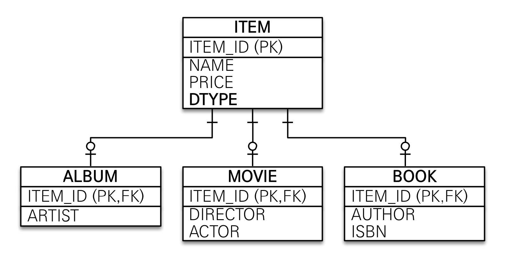
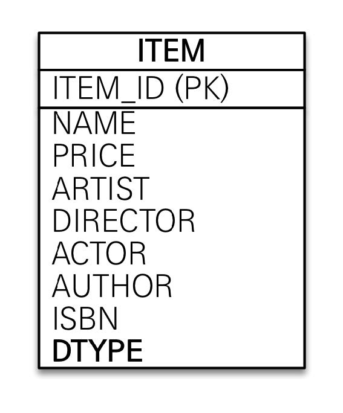
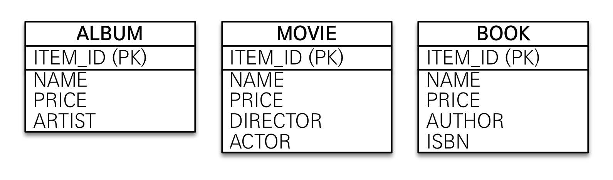

# 섹션 07. 고급 매핑
## 01. 상속관계 매핑
`RDB`에는 상속 관계라는 것이 없다.
- 하지만 `슈퍼타입, 서브타입 관계`라는 논리 모델링 기법으로 `객체 상속`과 매핑 할 수 있음
- 즉, `상속관계 매핑`이라는 것은 `객체의 상속 구조`와 `DB의 슈퍼타입 서브타입 관계`를 매핑하는 것
- `슈퍼타입 서브타입 논리 모델`을 실제 `물리 모델`로 구현하는 방법
  - `각각 테이블로 변환`, `통합 테이블로 변환`, `서브타입 테이블로 변환`
- 주요 `annotaion`
  1. `@Inheritance(strategy = InheritanceType.{전략})`
     - `JOINED`: 조인 전략
     - `SINGLE_TABLE`: 단일 테이블 전략
     - `TABLE_PER_CLASS`: 구현 클래스 별 테이블 전략
  2. `@DiscriminatorColumn`
     - 부모 클래스에 사용하며, `슈퍼타입(부모)` 테이블에 `DTYPE` 속성을 추가한다.
     - `name` 속성 기본 값은 `"DTYPE"`이다.
  3. `@DiscriminatorValue("{지정 할 이름}")`
     - 자식 클래스에 사용하며, `부모 테이블`의 `DTYPE` 속성 컬럼에 저장될 `엔티티 이름을 지정`
     - 엔티티 이름을 저장하기에 기본 값은 `엔티티 명`이다.  
### JOINED - 조인 전략

- `장점`: 테이블의 정규화, 정석 전략이라 할 수 있음
  - `FK 참조` 무결성 제약 조건 활용이 가능
  - 저장공간 효율화
- `단점`: 조회 시 조인을 많이 사용 → 성능 저하
  - 조회 쿼리 복잡
  - 데이터 저장 시 `INSERT SQL` 2회 호출  
  

### SINGLE_TABLE - 단일 테이블 전략

- `장점`: 조인이 필요 없어 일반적으로 조회 성능이 빠름
  - 조최 쿼리 단순
- `단점`: 자식 엔티티가 매핑한 컬럼은 모두 `null` 허용
  - 단일 테이블에 모든 정보를 저장하므로 테이블이 `비대`해 질 수 있음
  - 상황에 따라 조회 성능이 더 떨어질 수 있음  
  

### TABLE_PER_CLASS - 구현 클래스 별 테이블 전략

- 추천되지 않는, 쓰면 안되는 전략이라고 강의에서 평가함
- `장점`: 서브 타입을 명확하게 구분해서 처리 할 때 효과적
  - `not null` 제약조건 사용 가능
- `단점`: 여러 자식 테이블을 함께 조회할 때 성능이 느림
  - 자식 테이블을 통합해서 쿼리하기 어려움  
   

## 02. Mapped Superclass - 매핑 정보 상속
상속관계 매핑과 관련 내용이 아님, `공통 매핑 정보`를 매핑해 `반복되는 부분을 줄이는 목적`으로 사용
- `상속 관계 매핑`, `엔티티`, `테이블 매핑` 전부 해당하지 않음
- 즉, `@MapperdSuperclass`가 적용된 클래스의 `매핑 정보`만 `자식 클래스에 제공`한다.
  - 사용 방법은 해당 `annotation`이 적용된 클래스를 `공통 매핑 정보`를 사용할 클래스에 `상속(extends)`하기만 하면 됨 
- 당연하지만 해당 `annotation` 적용 클래스는 `조회, 검색`이 불가능 하다.
- 직접 생성해서 사용 할 일이 없으므로 `추상 클래스(abstract class)`로 작성하는 걸 권장한다.
> 참고!   
> `@Entity` 클래스는 같은 `@Entity` 클래스 또는 `@MappedSuperclass`로 지정한 클래스만 상속 받을 수 있음