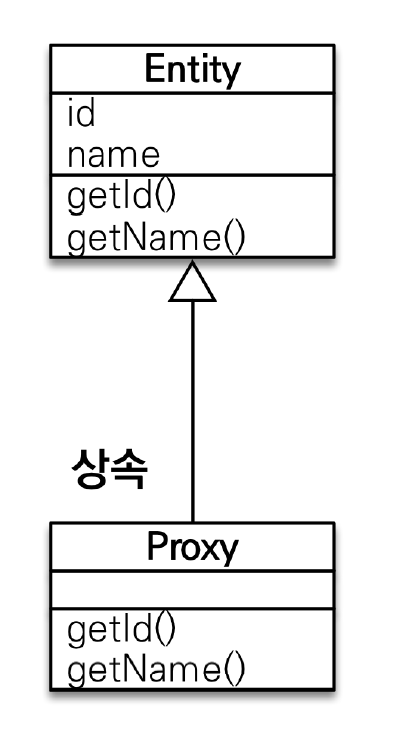
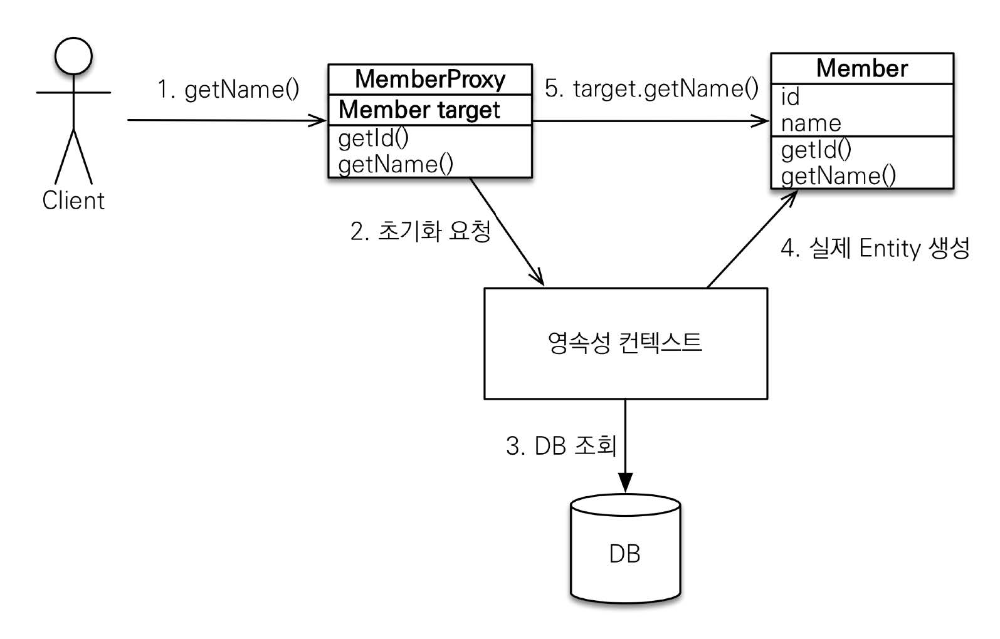
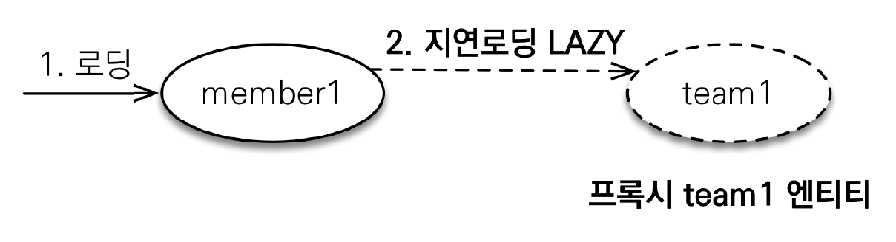
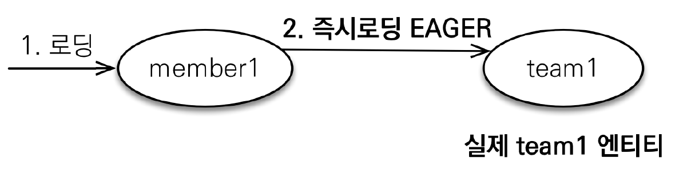

# 섹션 08. 프록시와 연관관계 관리
## 01. 프록시
`JPA`에는 2가지 `객체 조회 방법`이 있다.
1. `em.find()`: `DB`를 조회해 `실제 엔티티` 조회
2. `em.getReference()`: `DB` 조회를 미루기 위해 `가짜(프록시) 객체` 조회
   - 초기 `프록시 객체`는 실제 엔티티 객체와 `모양은 같으나 속이 텅텅 빈` 상태  
### 프록시 특징
프록시는 `실제 클래스`를 상속 받아 만들어진다.   

- 그래서 실제 클래스와 `겉 모양`이 같다.
- 이론상 사용자하는 입장에서는 `실제 객체`와 `프록시 객체`를 구분하지 않고 사용하면 된다.
- 프록시 객체는 `실제 객체의 참조(target)`을 보관한다.
   - `프록시 객체를 호출 → 프록시 객체는 실제 객체의 메서드 호출`   
<br/><br/>

### 프록시 객체의 초기화
처음 호출한 프록시 객체는 `속 빈 강정`인데, 이를 사용하기 위해서는 `실제 객체`를 참조 할 수 있도록 `초기화`가 필요하다.   
   
```
Member member = em.getReference(Member.class, "id1");    // [1]
member.getName();    // [2]]
```
- `[1]`에서 프록시 객체 호출
- `[2]`에서 `getName()` 메서드 호출
  1. 현재 프록시 객체는 실제 객체를 참조하지 않는 상태
     - 그래서 호출 메서드를 수행하기 위해서는 `실제 객체 조회`가 필요함
  2. `JPA`는 영속성 컨텍스트에 `프록시 객체 초기화(실제 객체)`를 요청하고
  3. 영속성 컨텍스트는 `DB`에서 실제 객체 조회
  4. 조회 된 실제 객체 `엔티티를 생성`하고 프록시 객체가 참조하도록 연결
  5. 실제 엔티티의 `getName()`를 통해서 결과 값이 반환 됨   
<br/><br/>

### 프록시 정리
- 프록시 객체는 처음 사용 시에 한 번만 초기화된다.
  - 초기화 된다고 해서 `실제 객체로 바뀌는 건 아님`
  - 초기화는 `실제 엔티티`에 접근이 가능해지는 것
- 프록시 객체는 `실제 객체를 상속` 받음
  - 따라서 타입 체크 시 `== 비교`가 아닌 `instance of`를 사용해야 한다.
- 만약 `영속성 컨텍스트 1차 캐시`에 조회 할 엔티티가 이미 있다면 `프록시 객체를 호출해도 실제 엔티티를 반환`한다.
  - 반대의 경우도 마찬가지다 초기 `프록시 객체`로 조회를 했다면 이후 `실제 엔티티`를 조회해도 `프록시 객체`가 반환된다.
- 영속성 컨텍스트의 `도움을 받을 수 없는 상태`일 때, 프록시를 초기화하면 문제가 발생한다.
  - 프록시 초기화 전에 `em.clear()`, `em.close()`, `em.detach()`를 사용 한 경우
    - 프록시 객체 초기화에는 `영속성 컨텍스트`의 도움이 필요하기 때문이다.
  - 하이버네이트 `LazyInitializationException` 예외 발생   
<br/><br/>

### 프록시 확인
- `PersistenceUnitUtil.isLoaded(Object entity)`: 프록시 객체 초기화 여부 확인
- `entitiy.getClass().getName()`: 프록시 클래스 확인
- `Hibernate.initialize(proxy_entity)`: 프록시 강제 초기화
  - `JPA` 표준은 강제 초기화 없음
  - `강제 호출`: entity.getName() → 실제 엔티티 메서드 호출 (뭔가 애매)   
<br/><br/><br/>

## 02. 즉시 로딩과 지연 로딩
### LAZY - 지연 로딩
   
```java
@Entity
public class Member { 
    @Id
    @GeneratedValue
    private Long id;

    @Column(name = "USERNAME")
    private String name;

    @ManyToOne(fetch = FetchType.LAZY) // [1] fetch 속성을 LAZY 로 지정
    @JoinColumn(name = "TEAM_ID")
    private Team team;
}
```
- `[1]`에서 `@ManyToOne`의 `fetch` 속성을 `FetchType.LAZY`로 설정
  - 이는 연관관계 엔티티를 `프록시`로 조회하겠다고 지정 한 것
  - 즉, 예시 코드 기준으로 `DB 조회`를 통한 실제 엔티티 조회는 `Member`만, `Team`은 프록시로 조회
  - 실제 엔티티 조회를 선택적으로 할 수 있다.   
<br/><br/>

### EAGER - 즉시 로딩

```java
@Entity
public class Member { 
    @Id
    @GeneratedValue
    private Long id;

    @Column(name = "USERNAME")
    private String name;

    @ManyToOne(fetch = FetchType.EAGER) // [1] fetch 속성을 EAGER 로 지정
    @JoinColumn(name = "TEAM_ID")
    private Team team;
}
```
- `[1]`에서 `@ManyToOne`의 `fetch` 속성을 `FetchType.EAGER`로 설정
  - 이는 연관관계 엔티티도 `Member` 조회 시, `Team`도 항상 같이 조회하겠다도 지정한 것
  - 즉, 예시 코드 기준으로 `DB 조회`를 통해 `Member`, `Team` 둘 모두 같이 조회
    - 한 번의 쿼리로 모든 엔티티르 조회   
<br/><br/>

### 프록시와 즉시 로딩 주의
대부분의 경험있는 개발자들은 실무에서 가급적 `지연 로딩`만 사용하라고 한다.
- `즉시 로딩` 사용 시 예상치 못한 `SQL`이 발생 할 수 있다.
- `JPQL`에서 `N+1 문제`를 일으킴
  - `Member`를 조회해 왔더니 `즉시 로딩`이라 `Team`도 재 조회하기 때문에 발생하는 문제
  - `쿼리 하나`를 날렸는데 추가로 쿼리 `N개`가 나가는 문제라고 해서 `N+1 문제`라고 말 한다.
- `@ManyToOne`, `@OneToOne`는 기본이 `즉시 로딩`이므로 `지연 로딩`으로 설정하자.
  - `@OneToMany`, `@ManyToMany`는 기본이 `지연 로딩`이다.
> _정리_   
> 기본적으로 모든 연관관계에는 `지연 로딩`을 사용하자. `즉시 로딩?` 고민도 하지 말자!   
> `JPQL fetchJoin`, `엔티티 그래프` 기능을 사용하자.   

<br/><br/><br/>

## 03. 영속성 전이(CASCADE)와 고아 객체
### 영속성 전이 - CASCADE
특정 엔티티를 `영속화(persist)` 할 때, 연관 엔티티도 `함께 영속화 시키기` 위해 사용 함
- ex) 부모 엔티티 영속화 시, 자식 엔티티도 같이 영속화
- 목적은 연관 엔티티 영속화지만, `연관관계 매핑과 상관 없다`.
  - 그저 엔티티 영속화 시 `연관 엔티티도 함께 영속화하는 편리함`만 제공
- `자식 엔티티를 관리`하는 `부모 엔티티가 하나` 일 때, 사용하도록 하자.
- `annotation`이 적용된 필드에 해당하는 엔티티를 `함께 영속화` 한다.
#### 종류
- `ALL`: 모두 적용
  - `PERSIST`: 영속
  - `REMOVE`: 삭제
  - `MERGE`: 병합
  - `REFRESH`: refresh
  - `DETACH`: detach   
<br/><br/>

### 고아 객체
표현이 좀 뭐시기 하지만 `고아 객체`란 `부모 엔티티와 연관관계가 끊어진 자식 엔티티`를 말 한다.
- `고아 객체 제거`: 연관관계가 끊긴 자식 엔티티를 `자동으로 삭제`하는 기능
  - ex) `@OneToMany(orphanRemoval = true)`
#### 주의!
기본적으로 `참조가 제거된 엔티티는 다른 곳에 참조하지 않는다는` 전제하게 `고아 객체`로 보고 삭제하는 기능이다.
- 그러므로 `부모 엔티티(관리)`가 하나 일 때 사용해야 함 = `특정 엔티티만 개인 소유 할 때 사용`
- 위와 같은 특징 때문에 `@OneToMany`, `@OneToOne`에서만 사용 가능
> 참고!   
> 개념적으로 보면 부모 엔티티 제거 시 자식 엔티티는 고아 객체가 된다.   
> 이것은 `CascadeType.REMOVE`처럼 동작한다.   

<br/><br/>

### 영속성 전이 + 고아 객체 = 자식 엔티티 생명주기 관리
`CascadeType.ALL` + `orphanRemoval = true`
- 두 옵션을 모두 활성화 하면, `부모 엔티티`를 통해 `자식 엔티티`의 생명주기를 관리 할 수 있음
  - 원래라면 엔티티 자체적으로 `em.persist(), em.remove()`를 사용해 생명주기 관리
- `도메인 주도 설계(DDD)`의 `Aggregate Root` 개념을 구현 할 때 유용하게 사용 가능