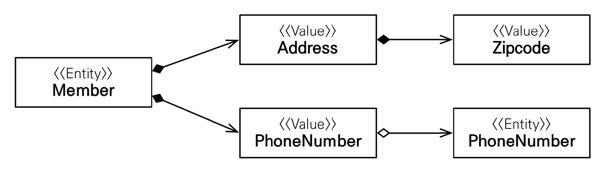

# 섹션 09. 값 타입
## 01. 기본 값 타입
### JPA 데이터 타입 분류
- `엔티티 타입`: `@Entity`로 정의한 객체
  - 데이터가 변해도 `식별자`로 지속해서 추적이 가능
  - ex) `Member` 엔티티의 나이, 이름을 변경해도 `식별자`로 인식 가능
- `값 타입`: `int`, `String` 등 처럼 단순히 `값`으로 사용하는 자바 기본 타입 또는 객체
  - `식별자가 없어` 변경 시 추적이 불가능
  - ex) `int age`의 값을 `100 → 200` 변경 시 완전히 다른 값으로 대체가 됨
  - 값 타입에는 `3가지` 종류가 있음   
<br/><br/>

### 값 타입 분류
- `기본 값 타입`
  - `자바 기본 타입`: `int`, `double` 등
  - `래퍼 클래스`: `Integer`, `Long` 등
  - `String`
- `임베디드 타입(embedded type, 복합 값 타입)`
- `컬렉션 값 타입(collection valu type)`   
<br/><br/>

### 기본 값 타입
생명주기를 `엔티티에 의존`하는 값 타입
- 엔티티가 삭제되면 해당 엔티티의 필드들도 같이 삭제 됨
  - ex) `String name`, `int age` 등
- 값 타입은 `공유하면 안된다`.
  - ex) 특정 회원의 이름 변경 시 또 다른 회원의 이름도 변경 되어선 안 됨
> _참고!_   
> 자바의 `기본 타입(primitive type)`은 값을 공유하지 않는다.   
> 기본 타입이 아니라 저장된 값을 복사해 저장하기 때문이다.   
> 
> `래퍼 클래스(Integer, Long)`나 `특수 클래스(String)`은 레퍼런스가 넘어가 같은 인스턴스를 공유한다.   
> 하지만 값을 변경 할 수 있는 방법이 없으므로 공유는 가능하나 변경이 불가능하다.   

<br/><br/><br/>

## 02. 임베디드 타입 (복합 값 타입)
`내장 타입`이라고도 말하며, 새로운 값 타입을 `직접 정의` 할 수 있다.
- 주로 `기본 값 타입들을 모아` 만들기에 `복합 값 타입`이라고도 한다.
### 사용 방법
```java
@Entity
public class Employee {
    @Id
    @GeneratedValue
    private Long id;

    @Column(name = "employee_name")
    private String name;

    @Embedded   // 임베디드 타입을 사용 하는 곳에 정의
    private Period period;

    @Embedded   // 임베디드 타입을 사용 하는 곳에 정의
    private Address address;
    
    public Employee() {}    // 기본 생성자 필수
}

@Embeddable     // 임베디드 타입 클래스에 정의
public class Period {

    private LocalDateTime startDate;
    private LocalDateTime endDate;

    public Period() {}      // 기본 생성자 필수
}

@Embeddable     // 임베디드 타입 클래스에 정의
public class Address {

    private String city;
    private String street;
    private String zipcode;

    public Address() {}     // 기본 생성자 필수
}
```
- `@Emebeddable`: 값 타입을 정의하는 곳에 표시
- `@Embedded`: 값 타입을 사용하는 곳에 표시
- 기본 생성자 필수   
<br/><br/>

### 장점
임베디드 타입은 `재사용`과 `높은 응집도`를 장점으로 갖는다.
- 특정 값 타입만 사용하는 `의미있는 메서드`를 만들 수가 있다.
  - ex) `Period.isWork()`
- 임베디드 타입도 값 타입이기에, `속한 엔티티의 생명주기에 의존`한다.
  - 엔티티가 삭제되면 임베디드 타입도 삭제된다.   
<br/><br/>

### 테이블 매핑

- 따로 신경 쓸 부분이 없다. `매핑하는 테이블이 같다`는 말이다.
  - 임베디드 타입은 `엔티티의 값`일 뿐이기 때문이다.
  - 물론 `세밀하게(find-grained)` 매핑하는 것이 가능하다.
- 잘 설계한 `ORM 애플리케이션`은 매핑한 테이블의 수 보다 `클래스의 수가 많다`.
  - `매핑 테이블 수 < 클래스 수`   
<br/><br/>

### 연관관계

- 임베디드 타입은 `엔티티`를 참조 할 수 있다.
  - 참조 할 엔티티를 `FK`로 가지기만 하면 된다.   
<br/><br/>

### @AttributeOverride (속성 재정의)
한 엔티티 안에서 같은 값 타입을 중복해서 사용 할 경우에 사용한다.
```java

@Entity
public class Employee {
  //...

  @Embedded
  private Address address;

  @Embedded
  @AttributeOverrides({ // 중복으로 사용 할 임베디드 타입의 컬럼 명들을 모두 재정의 해준다.
          @AttributeOverride(name = "city", column = @Column(name = "sub_city")),
          @AttributeOverride(name = "street", column = @Column(name = "sub_street")),
          @AttributeOverride(name = "zipcode", column = @Column(name = "sub_zipcode"))
  })
  private Address subAddress;
}
```
- 사용하지 않을 경우 컬럼 명이 중복되 예외가 발생한다.
- `@AttributeOverrides`, `@AttributeOverride`를 사용해 컬럼 명 속성을 재정의 하면 된다.   
<br/><br/>

### 임베디드 타입과 null
임베디드 타입의 값이 `null`일 경우 해당 타입에 속한 필드 모두 `null`값을 가진다.   
<br/><br/><br/>

## 03. 값 타입과 불변 객체
> `값 타입`은 복잡한 객체 세상을 조금이라도 `단순화`하기 위해 생긴 개념!   
> 따라서 `단순`하고 `안전`하게 다룰 수 있어야 한다.   

### 값 타입 공유 참조
`임베디드 타입` 같은 값 타입을 `여러 엔티티`에서 공유하면 위험하다.


- 위 그림과 같은 `부작용(side effect)`가 발생 할 수 있다.   
<br/><br/>

### 값 타입 복사
값 타입의 인스턴스 공유는 위험하기에 `값(인스턴스)`를 복사해서 사용해야 한다.

   
<br/><br/>

### 객체 타입의 한계
항상 값을 복사해서 사용하면 `공유 참조`로 인한 부작용을 피할 수는 있다.
- 하지만 `직접 정의한 값 타입`은 임베디드 타입처럼 `객체 타입`이다.
  - 기본 타입이라면 값을 복사해서 저장
  - 객체 타입이라면 `참조 값`을 복사해 저장 → 이 부분을 막을 방법이 없다.
    - 공유 참조를 막을 방법이 없기 때문에 `완벽한 해결책이 없다`.   
<br/><br/>

### 불변 객체
객체 타입의 `수정을 불가능하게` 만들면 `부작용 원천 차단`이 가능하다.
- 값 타입은 `불변 객체(immutable object)`로 설계해야 한다.
  - `불변 객체`: 생성 이 후 절대 값을 변경 할 수 없는 객체
  - 한 마디로 `생성자`로만 값을 설정, `수정자(Setter)`를 만들지 않는다.
  - 자바에서 `Integer`, `String`이 대표적인 불변 객체이다.
- 불변이라는 `작은 제약`으로 부작용이라는 `큰 재앙`을 막을 수 있다.   
<br/><br/><br/>

## 04. 값 타입의 비교
인스턴스가 다르더라도 저장된 값이 같으면 같은 것으로 판단해야 함
- `동일성(identity) 비교`: 인스턴스의 `참조 값`을 비교, `== 비교`
- `동등성(equivalence) 비교`: 인스턴스의 `값`을 비교, `equals() 비교`
- 즉,직접 정의하는 값 타입은 `equals()`를 사용해서 동등성 비교를 해야한다.
  - 또한 `equals()`를 사용에 맞게 재정의해서 사용해야 한다.
  - `equals()`을 정의하지 않으면 기본적으로 `== 비교`를 하기 때문이다.   
<br/><br/><br/>

## 05. 값 타입 컬렉션
`값 타입`을 컬렉션에 담아 사용하는 것

   
```java
@Entity
public class Profile {
    @Id
    @GeneratedValue
    private Long id;

    @Column(name = "username")
    private String name;

    @ElementCollection                  // 테이블 매핑
    @CollectionTable(                   // 테이블 설정
            name = "login_history",     // 테이블 이름 지정
            joinColumns = @JoinColumn(name = "login_id")    // 생성 테이블에 FK 및 FK 컬럼 명 지정
    )
    private List<Login> loginHistory = new ArrayList<>();   // 값 타입 컬렉션
    
    public Profile() {}
}

@Embeddable
public class Login {

    private String loginName;
    private LocalDateTime loginAt;
    
    public Login() {}
}
```
- 값 타입을 하나 이상 저장 할 때 사용한다.
- `@ElementCollection`과 `@CollectionTable`을 사용해 테이블을 매핑/설정 해준다.
- `DB`에는 컬렉션을 저장 할 수 없기 때문에 `일대다`로 분리해서 저장해야 한다.
  - 즉, 컬렉션 저장을 위해서는 별도의 테이블이 필요하다는 이야기이다.
### 사용 예시
#### 저장
```
Profile profile = new Profile();
profile.setName("profile1");
profile.getLoginHistory().add(new Login("first", LocalDateTime.now()));
profile.getLoginHistory().add(new Login("second", LocalDateTime.of(2024, 10, 4, 12, 10, 10)));

em.persist(profile);
```
- 엔티티 객체 생성 후 `값 타입 컬렉션`에 값 타입을 생성해 저장한다.
- 엔티티 객체를 `persist()`하고 트랜잭션을 커밋한다.
  - 값 타입 컬렉션 또한 `생명주기를 엔티티에 의존`한다.
  - 그래서 엔티티 등록 시, 값 타입 컬렉션도 등록 된다. → 따로 `persist()` 할 필요가 없다.
- `생명주기`를 의존하기 때문에, `영속성 전이(Cascade) + 고아 객체 제거` 기능을 필수로 가진다고 볼 수 있음   
<br/>

#### 조회
```
Profile findProfile = em.find(Profile.class, profile.getId());

List<Login> findLoginHistory = findProfile.getLoginHistory();
for (Login login : findLoginHistory) {
  System.out.println("loginHistory :" + login.getLoginAt());
}
```
- 조회한 엔티티 객체의 `값 타입 컬렉션`을 통해 `값 타입`이 가진 정보를 조회가 가능하다.
- 값 타입 컬렉션도 `지연 로딩` 전략을 사용한다.   
<br/>

#### 수정
```
Profile findProfile = em.find(Profile.class, profile.getId());

findProfile.getLoginHistory().remove(new Login("second", LocalDateTime.of(2024, 10, 4, 12, 10, 10)));
findProfile.getLoginHistory().add(new Login("third", LocalDateTime.of(1, 1, 1, 1, 1, 1)));
```
- `equals 해시코드`가 중요한 순간이다.
  - 기본적으로 컬렉션들은 대상 탐색시 `equals`를 사용한다.
  - `remove()` 메서드의 대상을 탐색 시 `equals`를 사용하며, 제대로 구현 되어 있지 않다면 제대로 작동하지 않는다.
- 보기에는 `기존의 값을 똑같이 넣어서 지워`주고, `새로운 값을 다시 넣어`주는 것 처럼 보인다.
  - 사실은 `값 타입 컬렉션`의 `데이터를 모두 삭제 후 현재 값을 모두 다시 저장`한다.
    - 이걸 왜 씀?   
<br/><br/>

### 제약 사항
- 값 타입은 `식별자 개념 없음`
  - 따라서 `변경 시 추적 어려움`
- `변경 사항(수정)`이 발생하면 엔티티와 연관된 `모든 데이터를 삭제` 후, `값 타입 컬렉션의 현재 값을 모두 다시 저장`
- 값 타입 컬렉션을 매핑하는 모든 테이블은 `모든 컬럼을 묶어` `PK(기본 키, 식별 키)`를 구성해야 함
  - `null 입력 불가`, `중복 저장 불가`
- 맞다 이걸 쓸 이유가 전혀 없다.   
<br/><br/>

### 대안
값 타입 컬렉션 대신에 `일대다 관계`를 사용하자.

```java
import jakarta.persistence.*;

@Entity
public class Profile {
  @Id @GeneratedValue
  private Long id;

  @Column(name = "username")
  private String name;

  @OneToMany(cascade = CascadeType.ALL, orphanRemoval = true)
  @JoinColumn(name = "member_id")
  private List<LoginEntity> loginHistory = new ArrayList<>();   // 엔티티 컬렉션
}

@Entity
public class LoginEntity {  // 값 타입을 매핑한 엔티티
  @Id @GeneratedValue
  private Long id;

  @Embedded
  private Login login;      // 임베디드 타입 Login 사용

  public Login() {}
}

@Embeddable
public class Login {

  private String loginName;
  private LocalDateTime loginAt;

  public Login() {}
}
```
- 일대다 관계를 위한 `엔티티`를 추가하고 `값 타입 컬렉션` 대신 `엔티티 컬렉션` 사용
  - 추가 된 엔티티에서 `값 타입`을 사용(또는 관리)
  - `영속성 전이(Cascade) + 고아 객체 제거`까지 사용하면 유사하게 사용 가능
- 대안이라고는 하지만 복잡한 것은 여전함...   
<br/><br/>

### 정리
- 엔티티 타입
  - `식별자 존재`, `생명 주기 관리`, `공유`
- 값 타입 특징
  - `식별자 없음`, `엔티티에 생명 주기 의존`, `공유하지 않는 걸 권장(복사해서 사용)`, `불변 객체 추천`
- 엔티티와 값 타입을 혼동하지 않도록 하자
  - 값 타입은 정말 값 타입이라 판단될 때만 사용하자
  - 식별자가 필요 없고, 지속해서 추적할 필요 없으며 변경이 필요 없다면 `값 타입`
  - 반대의 경우 `엔티티`, 대부분이 엔티티이지 않을까 싶다.