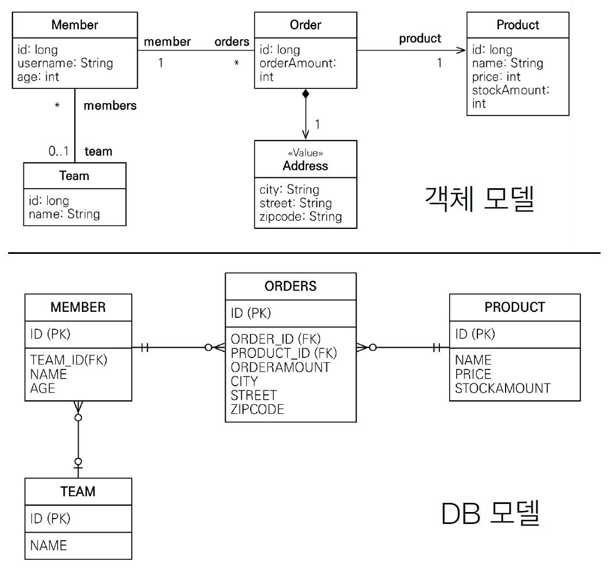
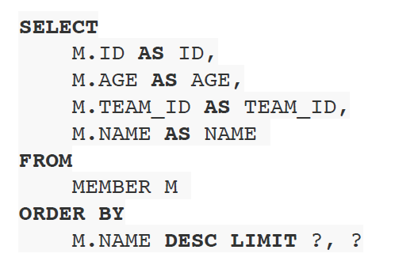
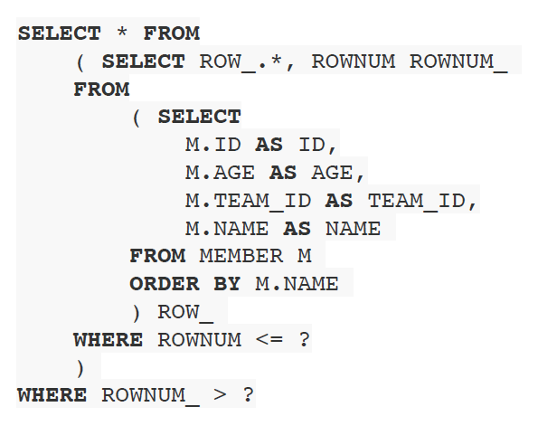

# 섹션 10. 객체지향 쿼리 언어 1 - 기본 문법
## 02. 기본 문법과 쿼리 API
### 예제 사용 ERD
  
<br/><br/>

### JPQL 문법
```
select_문 :: = 
    select_절
    from_절
    [where_절]
    [groupby_절]
    [having_절]
    [orderby_절]
    
update_문 :: = update_절 [where_절]

delete_문 :: = delete_절 [where_절]
```  
<br/>

#### 예시
```
select o from Order as o where o.orderAmount > 10
```
- `엔티티`와 `속성`은 대소문자로 구분한다.
  - ex) `Order(엔티티)`, `orderAmount(속성)`
- `JPQL 키워드`는 대소문자를 구분하지 않는다.
  - ex) `select = SELECT`, `from = FROM`, `where = WHERE`
- 타겟의 이름은 `엔티티 명`을 사용한다.
  - ex) 현재 `엔티티 명(=Order)`이고 `테이블 명(=ORDERS)`이기에 `ORDERS`가 아닌 `Order`를 사용해야 함
- 별칭은 필수적으로 작성해줘야 한다.
  - ex) `o(별칭)`, 엔티티의 속성에 접근 할 때, `별칭을 통해서 접근(o.orderAmount)`
  - `as` 같은 경우 생략이 가능하지만 적어주는 편이 좋다.  
<br/><br/>

### 집합과 정렬
`ANSI SQL`의 표준 기능 또한 전부 제공된다.
```
select
    COUNT(m),       // 회원 수
    SUM(m.age),     // 나이 합
    AVG(m.age),     // 평균 나이
    MAX(m.age),     // 최대 나이
    MIN(m.age)      // 최소 나이
from Member m
```
- `GROUP BY`, `HAVING`, `ORDER BY` 전부 그대로 사용이 가능하다.  
<br/><br/>

### TypeQuery, Query
`TypeQuery(반환타입 명확)`, `Query(반환타입 불명확)` 할 때 사용한다.
#### 예시
```java
TypedQuery<Member> query1 = em.createQuery("select m from Member m", Member.class);             // [1]
TypedQuery<String> query2 = em.createQuery("select m.username from Member m", String.class);    // [2]
Query query3 = em.createQuery("select m.username, m.age from Member m");                        // [3]
```
- `[1]`의 경우, `Member` 엔티티를 `select`하므로 반환 타입이 `Member`인게 명확하다.
  - 그래서 `TypeQuery<Member>`를 통해 쿼리를 저장한다.  
<br/>

- `[2]`의 경우, `Member` 엔티티의 `username` 속성을 `select`하는데 해당 속성은 `String` 타입으로 반환 타입이 명확하다.
  - 그래서 `TypeQuery<String>`을 통해 쿼리를 저장한다.  
<br/>

- `[3]`의 경우, `Member` 엔티티의 `username 과 age` 속성 둘을 `select`하는데 타입이 `String 과 int`로 다르다.
  - 그렇기 때문에 반환 타입이 불명확하다.
  - 그래서 `Query`를 통해 쿼리를 저장한다.  
<br/><br/>

### 결과 조회 API
#### 예시
```java
// 조회 결과가 하나 이상 일 때, 컬렉션 반환
List<Member> resultList = query.getResultList();    // [1]

// 조회 결과가 하나 일 때, 단일 객체 반환
Member result = query.getSingleReuslt();            // [2]
```
- 여러 조회 결과를 반환 받을 때는 `[1]`처럼 사용하며 `컬렉션`으로 반환 받는다.
  - 만약 조회 결과가 없다면 `빈 리스트`가 반환된다.  
<br/>

- 단일 조회 결과를 반환 받을 때는 `[2]`처럼 사용하며 `단일 객체`로 반환 받는다.
  - 조회 결과가 없다면 `NoReusltException`이 발생한다.
  - 조회 결과 `1개`가 아닌 `2개` 이상일 경우 `NonUniqueResultException`이 발생한다.  
<br/><br/>

### 파라미터 바인딩
#### 이름 기준
```
TypedQuery<Member> query = em.createQuery("select m from Member m where m.username = :username", Member.class);
query.setParameter("username", "member1");
Member findMember = query.getSingleResult();

// 메서드 체인 적용 (권장 방식)
Member findMember = em.createQuery("select m from Member m where m.username = :username", Member.class)
        .setParameter("username", "member1")
        .getSingleResult();
```
- 쿼리 작성시 `:{파라미터명}`을 통해 파라미터를 적용한다.
  - 이후 `setParameter({파라미터명}, {파라미터값})`을 통해 파라미터에 값을 세팅하면 된다.
- 메서드 체인 기능을 기본적으로 제공하기에 사용하는 것을 권장한다.
  - 보기 편하고 코드가 깔끔해진다.  
<br/>

#### 위치 기준
```
TypedQuery<Member> query = em.createQuery("select m from Member m where m.username = ?1", Member.class);
query.setParameter(1, "member1");
Member findMember = query.getSingleResult();

// 메서드 체인 적용 (권장 방식)
Member findMember = em.createQuery("select m from Member m where m.username = ?1", Member.class)
        .setParameter(1, "member1")
        .getSingleResult();
```
- 쿼리 작성시 `?{위치 값}`을 통해 파라미터를 적용한다.
  - 이후 `setParameter({위치 값}, {파라미터 값})`을 통해 파라미터에 값을 세팅하면 된다.
- 얼핏 보면 편해보이지만 `권장되지 않는 방식`이다.
  - `이름 기준` 시에는 중간에 위치가 바뀌어도 버그 발생이 없다.
  - 하지만 `위치 기준`의 경우 중간에 위치가 바뀌면 `버그가 발생하기 너무 좋다`.
    - 결국 `유지보수성`이 너무 떨어짐, 하나하나 다 신경써가면 수정해줘야 함  
<br/><br/><br/>

## 03. 프로젝션(SELECT)
`SELET 절`에 `조회 할 대상을 지정`하는 것
- `대상`: `엔티티`, `임베디드 타입`, `스칼라 타입(숫자, 문자 등 기본 데이터 타입)`
#### 예시
```
// 현재 작성된 Order 클래스 기준
select o from Order o               // 엔티티 프로젝션

selcet o.member from Order o        // 엔티티 프로젝션 → 해당 방법보다 join 을 사용하는게 더 효율적

select o.address from Order o       // 임베디드 타입 프로젝션

select o.orderAmount from Order o   // 스칼라 타입 프로젝션
```
- `DISTINCT`로 중복을 제거 할 수 있다.
  - ex) `select distinct o from Order o`  
<br/><br/>

### 여러 값 조회
`Query` 타입으로 조회
```java
List resultList = em.createQuery("select m.username, m.age from Member m")  // 타입이 명확하지 않아 타입 클래스 지정 X
        .getResultList();

Object o = resultList.get(0);                   // 반환 리스트에서 Object 타입으로 값 꺼내기
Object[] result = (Object[]) o;                 // Object 배열로 매핑해서 각각의 값 구분
System.out.println("username = " + result[0]);  // username = member1 출력
System.out.println("age = " + result[1]);       // age = 30 출력
```
- 굉장히 값을 꺼내는데 복잡하고 번잡스러워 보인다.
  - 쓰고 싶지 않다.  
<br/>

`Object[]` 타입으로 조회
```java
List<Object[]> resultList = em.createQuery("select m.username, m.age from Member m")    // 타입이 명확하지 않아 타입 클래스 지정 X
        .getResultList();

Object[] result = resultList.get(0);            // Object 배열 컬렉션에서 값 꺼내기
System.out.println("username = " + result[0]);  // username = member1 출력
System.out.println("age = " + result[1]);       // age = 30 출력
```
- 코드가 조금 줄었을 뿐이지 `Query` 타입 조회와 별다를 게 없다.
  - 이것 또한 쓰고 싶지 않다.  
<br/>

`new` 명령어로 조회 : `DTO`를 통한 조회
```java 
List<MemberDTO> result = em.createQuery("select new hellojpa.jpql.MemberDTO(m.username, m.age) from Member m", MemberDTO.class)
                    .getResultList();

MemberDTO memberDTO = result.get(0);                                // MemberDTO 컬렉션에서 값 꺼내기
System.out.println("member username = " + member.getUsername());    // member username = member1 출력
System.out.println("member age = " + member.getAge());              // member age = 30 출력
```
- `new` 명령어를 통해 `DTO` 객체를 생성해 값을 저장하는 방식이다.
  - `DTO`객체를 생성하는 방법이므로 `select 절`에 적을 `순서와 타입`이 일치하는 `생성자가 반드시 필요`하다.
    - ex) `select m.username, m.age`가 하고 싶으면 생성자 `public MemberDTO(String username, int age){}`가 필요하다.
  - 또한 해당 `DTO 클래스`의 클래스 명 뿐만 아니라 `전체 패키지 경로 또한 필요`하다.
    - ex) `select new {패키지 경로.DTO 클래스 명}({타입1}, {타입2})`으로 작성해야 함
- 3가지 방법 중 제일 깔끔한 것 같다.  
<br/><br/><br/>

## 04. 페이징
강사 피셜 `아트의 경지`
- `JPA`는 페이징을 아래의 두 `API`로 추상화 한다.
  - `setFirstResult(int startPosition)`: 조회 시작 위치, 0부터 시작
  - `setMaxResults(int maxResult)`: 조회할 테이터 수
#### 페이징 API 예시
```java
List<Member> result = em.createQuery("select m from Member m order by m.age desc ", Member.class)   // [1]
                    .setFirstResult(0)  // 조회 시작 위치 (인덱스는 0부터 시작)
                    .setMaxResults(10)  // 조회 할 데이터 수
                    .getResultList();   // Member 컬렉션 반환
```
- `[1]`부분을 분석 해보자.
  - `쿼리`: `order by m.age desc`
    - `desc`: 내림차순 정렬
    - `m.age`: 정렬 할 속성(필드)
    - `order by`: 정렬하기 위한 `속성`에 대한 정보와 `정렬 방식`을 가짐
- 페이징 관련 분석 : 예시의 경우 `나이가 많은 회원 10명을 조회한다`가 된다.
  - `setFirstResult(int index)`: 조회 시작 위치를 지정
  - `setMaxResults(int count)`: 조회 할 데이터 개수 지정  
<br/><br/>

### DB 별, 페이징 방언
#### MySQL

- `LIMIT ?, ?` 문법으로 쿼리가 나감  
<br/>

#### Oracle

- `low num 3 depth`로 쿼리가 나감  
<br/><br/><br/>

## 05. 조인
### 조인 종류
- `내부 조인(inner join)`: `select m from Member m [inner] join m.team t`
- `외부 조인(outer join)`: `select m from Member m left [outer] join m.team t`
- `세타 조인`: `select count(m) from Member m, Team t where m.username = t.name`
- `[]` 안의 내용은 생략이 가능하다.  
<br/><br/>

### ON 절
- 조인 전에 `대상 필터링` 가능
- `연관관계가 없는` 엔티티 `외부 조인 가능`함
#### 대상 필터링
```
// ex) 회원, 팀을 조인 할 때, 팀 이름이 `A`인 팀만 조인 

//JPQL
select m, t from Member m left join m.team t on t.name = 'A'

// SQL
SELECT m.*, t.* FROM Member m LEFT JOIN Team t ON m.TEAM_ID=t.id and t.name=`A`
```  
<br/>

#### 연관관계 없는 엔티티 외부 조인
```
// ex) 회원의 이름과 팀의 이름이 같은 대상 외부 조인

// JPQL
select m, t from Member m left join Team t on m.username = t.name

// SQL
SELECT m, t FROM Member m LEFT JOIN Team t ON m.username = t.name
```  
<br/><br/><br/>

## 06. 서브 쿼리
#### 예시
```
// 나이가 평균보다 많은 회원
select m from Member m
where m.age > (select avg(m2.age) from Member m2)

// 한 건이라도 주문한 회원
select m from Member m
where 0 < (select o from Order o where m = o.member)
```  
<br/>

### 지원 함수
`true`라고 판단한 데이터들만 가져온다.
- `[NOT] EXISTS (subquery)`: 서브쿼리에 결과가 존재하면 `true` 판단
  - `[NOT]`은 반대이다.
- `{ALL | ANY | SOME} (subquery)`
  - `ALL`: 조건을 모두 만족하면 `true` 판단
  - `ANY, SOME`: 같은 의미, 조건을 하나라도 만족하면 `true` 판단
- `[NOT] IN (subquery)`: 서브쿼리 결과 중 하나라도 같은 것이 있다면 `true` 판단
#### 예시
```
// 팀 A에 속한 회원 조회
select m from Member m
where exists (select t from m.team t where t.name = `팀 A`)

// 재고량 보다 주문량이 적거나 같은 주문들 조회
select o from Order o
where o.orderAmount <= ALL (select p.stockAmount from Product p)

// 어떤 팀에든 소속된 회원들 조회
select m from Member m
where m.team = ANY (select t from Team t)
```  
<br/><br/>

### JPA 서브 쿼리 한계
`JPA 표준 스펙`에서는 `WHERE 절`과 `HAVING 절`에서만 서브 쿼리 사용이 가능하다.
- 하이버네이트에서는 `SELECT 절`도 서브 쿼리를 지원한다.
- `FROM 절`의 서브 쿼리는 현재 `JPQL에서 불가능`하다.
  - 조인으로 풀 수 있다면 `풀어서 해결`해야 한다.
  - `하이버네이트6` 부터는 `FROM 절`의 서브쿼리를 지원한다.  
<br/><br/><br/>

## 07. JPQL 타입 표현과 기타 식
### JPQL 타입 표현
- `문자`: ex) `HELLO → 'HELLO'`, `She's → 'She''s'`
- `숫자`: ex) `10(Long) → 10L`, `10(Double) → 10D`
- `Boolean`: `true, false (대소문자 구분 없음)`
- `ENUM`: `{패키기 경로}.{enum 클래스명}Type.{타입명}`
- `엔티티 타입`: `TYPE({별칭}) = {엔티티 명}`
  - 상속 관계에서 사용  
<br/><br/>

### JPQL 기타 식
`SQL`과 문법이 다 똑같다.
- `EXISTS, IN`, `AND, OR, NOT`, `=, >, >=, <, <=, <>`, `BETWEEN, LIKE, IS NULL`  
<br/><br/><br/>

## 08. 조건식 (CASE 등등)
`JPA`에서 제공하는 `표준 함수`들이기 때문에 어떤 `DB`에서든 사용이 가능하다.
- `기본 CASE 식`: 조건에 따라서 지정된 내용을 수행한다.
  - 자바의 `switch-case 문`과 비슷하다.  
<br/>

- `단순 CASE 식`: 정확하게 매칭이 되면 매칭된 내용에 대한 작업을 수행  
<br/>

- `COALESCE`: 하나 씩 조회해서 `null 이라면 지정한 문자` 반환, `아니라면 실제 값` 반환
  - ex) 사용자 이름이 없으면 `"이름 없는 회원"`을 넣어 반환
    - `select coalesce (m.username, '이름 없는 회원') from Member m`  
<br/>

- `NULLIF`: 두 값이 같으면 `null` 반환, 다르면 `첫 번째 값(실제 값)을 반환`
  - ex) 사용자 이름이 `"관리자"`면 `null` 반환, 아닐 경우 사용자 이름 반환
    - `select NULLIF (m.username, '관리자') from Member m`  
<br/><br/><br/>

## 09. JPQL 함수
### 기본 함수
`JPA`에서 제공하는 `표준 함수`이므로 `DB 상관없이 사용이 가능`한 함수들
- `CONCAT`: 문자열 2개를 더 한다.
  - ex) `select concat({문자}, {문자}) from Member m`
- `SUBSTRING`: 부분 문자열 생성
  - ex) `select substring(m.username, 2, 3) from Member m`
- `TRIM`: 공백 제거
- `LOWER`, `UPPER`: 대소문자 변경
- `LENGTH`: 문자 길이
- `LOCATE`: 문자 위치
  - ex) `select locate('de', 'abcdefg') from Member m`
- `ABS`, `SQRT`, `MOD`: 수학 관련 함수
- `SIZE`, `INDEX(JPA 용도)`
  - `SIZE`는 컬렉션의 크기를 반환 해 줌
    - ex) `select size(t.members) from Team t`
  - `INDEX`는 컬렉션의 위치 값을 가져올 때 사용, 사용하지 않는 걸 권장  
<br/><br/>

### DB 별 구현 함수
기본적으로 각각의 `DB`들은 해당 데이터베이스를 사용하면 쓸 수 있는 `함수를 제공`한다.
- 물론 구현된 함수를 사용 할 경우 `DB`의 의존도가 높아지지만 굉자히 편리하게 사용 할 수 있다.  
<br/><br/>

### 사용자 정의 함수
`JPQL 기본 함수`에도 없고 `DB 구현 함수`에도 없는 함수를 사용하려면 `함수를 정의해서 사용`해야 한다.
```
select funtion({정의한 함수 명}, i.name) from Item i
```
- 사용하는 `DB`의 방언을 상속 받는 클래스를 생성한 후, 사용자 정의 함수를 등록한다.
- 등록 방법에 대해서는 외우기 보다 `DB에 이미 구현 된` 함수들을 참고해서 작성하도록 하자.